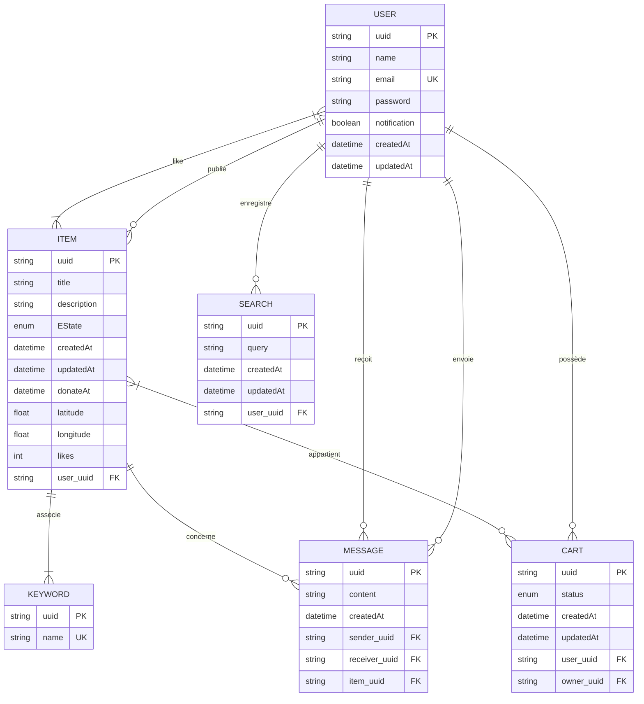

**Binôme : Youssef EL KADI & Mathéo GALUBA**
## 2. Architecture technique
### Stack technologique
- **Framework** : Spring Boot
- **Base de données** : SQLite3
- **ORM** : Spring Data JPA + Hibernate
- **Templating** : Thymeleaf
- **CSS** : pico css
- **Tests** : JUnit + Mockito

### Organisation du projet
Chaque ressource est autonome avec 4 composants principaux :
- Modèle JPA (@Entity)
- Repository (Spring Data JPA)
- Service (logique métier)
- Contrôleur

## 3. Modèle de données

## 4. Ressources

### Users
- `POST /users` - Création d'utilisateur
  ```json
  {
    "name": "string (1-100)",
    "email": "email@valid.com",
    "password": "string (min 8)",
    "notification": "boolean"
  }
  ```
- `GET /users/{uuid}` - Profil public d'un utilisateur
- `GET /users/me` - Profil privé de l'utilisateur connecté *authentifié*
- `POST /users/me/likes` - Ajouter un like à un item *authentifié*
  ```json
  {
    "item": "uuid"
  }
  ```
- `DELETE /users/me/likes` - Retirer un like *authentifié*
  ```json
  {
    "item": "uuid"
  }
  ```

### Items
- `GET /items` - Liste des items
	- Paramètres : `page`, `limit`, `q`, `keyword`
- `POST /items` - Création d'un item *authentifié*
  ```json
  {
    "title": "string",
    "description": "string",
    "keywords": ["array", "of", "strings"],
    "donateAt": "date",
    "latitude": "number",
    "longitude": "number"
  }
  ```
- `GET /items/{uuid}` - Détails d'un item
- `PUT /items/{uuid}` - Mise à jour d'un item *propriétaire uniquement*
  ```json
  {
    "title": "string",
    "description": "string",
    "state": "enum",
    "donateAt": "date"
  }
  ```
- `DELETE /items/{uuid}` - Suppression d'un item *propriétaire uniquement*

### Messages *authentifié*
- `POST /items/{itemUuid}/messages` - Envoyer un message
  ```json
  {
    "receiverUuid": "uuid",
    "content": "string (1-1000)"
  }
  ```
- `GET /items/{itemUuid}/messages` - Lire une conversation *participant uniquement*
- `GET /items/{itemUuid}/messages` - Liste les conversations *propriétaire uniquement*
	- Paramètre : `user` (permet d'afficher les messages de la conversation avec ce participant)

### Searches *authentifié*
- `POST /users/me/searches` - Sauvegarder une recherche 
  ```json
  {
    "query": "string"
  }
  ```
- `GET /users/me/searches/{uuid}` - Redirige vers le resultat de cette recherche
- `DELETE /users/me/searches/{uuid}` - Supprimer une recherche

### Keywords
- `GET /keywords` - Liste des mots-clés
	- Paramètres optionnels: `q`, `page`, `size`
- `GET /keywords/{uuid}` - Détails d'un mot-clé

> Les mots-clés sont créés lors de l'ajout d'un item s'ils n'existent pas déjà.

### Carts *authentifié*
- `GET /user/me/carts` - Liste tous les lots
- `GET /user/me/carts/{uuid}` -  Détails d'un lot
- `POST /users/me/carts/items/{item_uuid}` - Ajoute un item à un lot (créé le lot s'il n'existe pas)
- `DELETE /users/me/carts/items/{item_uuid}` - Supprime un item d'un lot
- `PATCH /user/me/carts/{uuid}` - Modifie le status d'un lot
	- DRAFT -> SENT (accessible par le créateur du lot)
	- SENT -> ACCEPTED (Accessible par le propriétaire des objets du lot)
	- SENT -> REFUSED  (Accessible par le propriétaire des objets du lot)

## 5. Exécution
Compiler le projet
```bash
./gradlew build
```

Lancer l'application
```bash
./gradlew bootRun
```

Exécuter les tests
```bash
./gradlew test
```